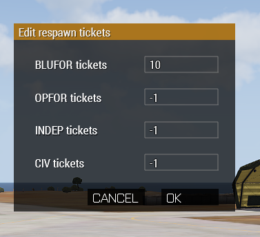

# addRespawnTicketModule

This module help you create and manage a custom tickets respawn system.



## Usage

You have 4 field for each sides, each field correspond to one variable inside the mission namespace.

- Blufor = `timberZA_main_BluforTicketCount`
- Opfor = `timberZA_main_OpforTicketCount`
- Independent = `timberZA_main_IndepTicketCount`
- Civilian = `timberZA_main_CivilianforTicketCount`

### Getting remaining tickets

```sqf
// this will give you the current ticket count for blufor
private _bluforTicketCount = missionNamespace getVariable "timberZA_main_BluforTicketCount";
```

###  Adding tickets

```sqf
// this will give you the current ticket count for blufor
private _bluforTicketCount = missionNamespace getVariable "timberZA_main_BluforTicketCount";
/ /This will change the ticket count for blufor because getVariable works by reference
_bluforTicketCount = 100;

// or you can be more explicit and achieve the same result
missionNamespace setVariable ["timberZA_main_BluforTicketCount", 100];
```

## Practical example

```sqf
{
    _x addEventHandler ["Respawn", {
        params ["_unit", "_corpse"];

        switch (side _unit) do {
            case west : {
                private _bluforTicketCount = missionNamespace getVariable "timberZA_main_BluforTicketCount";
                missionNamespace setVariable ["timberZA_main_BluforTicketCount", _bluforTicketCount - 1];
            };
            case east : {
                private _opforTicketCount = missionNamespace getVariable "timberZA_main_OpforTicketCount";
                missionNamespace setVariable ["timberZA_main_OpforTicketCount", _opforTicketCount - 1];
            };
            case independent : {
                private _indepTicketCount = missionNamespace getVariable "timberZA_main_IndepTicketCount";
                missionNamespace setVariable ["timberZA_main_IndepTicketCount", _indepTicketCount - 1];
            };
            case civilian : {
                private _civilianTicketCount = missionNamespace getVariable "timberZA_main_CivilianforTicketCount";
                missionNamespace setVariable ["timberZA_main_CivilianforTicketCount", _civilianTicketCount - 1];
            };
        };
    }];
} foreach allPlayers;
```