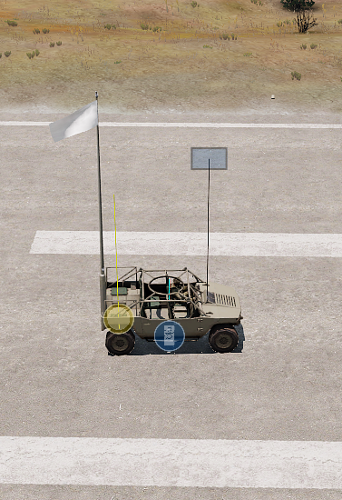
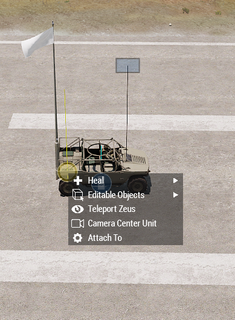
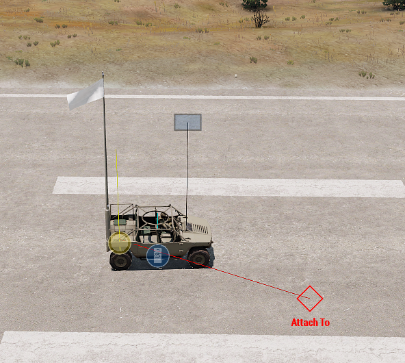

# Attach To context menu

This is a shortcut to the ZEN AttachTo module.

# Usage

1. It's very easy to use. You will need an object to attach and an object to attach to.

   
2. Right click on the object you want to attach and click on "Attach to".

3. Now click on the object you want to attach to.

   
4. Enjoy !

