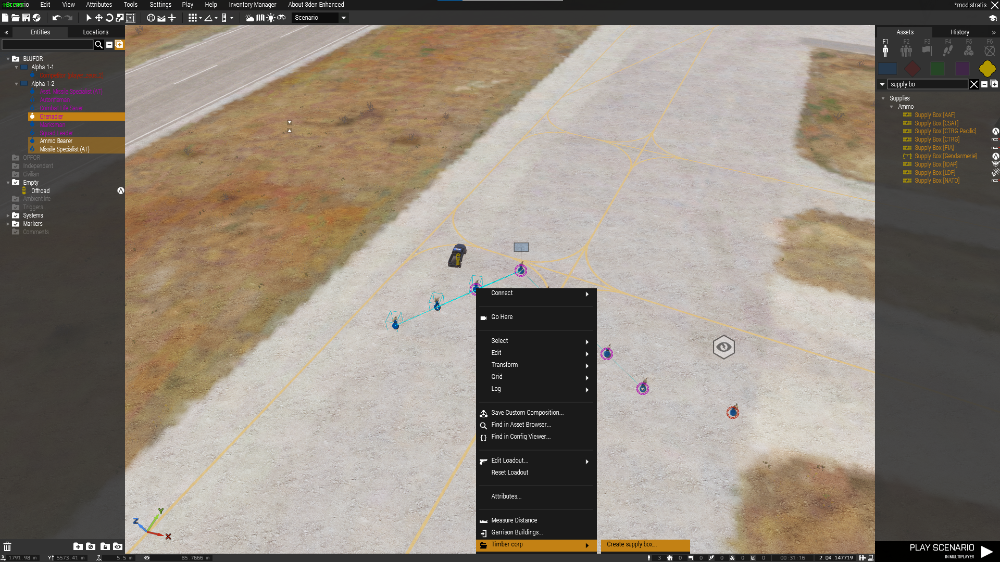
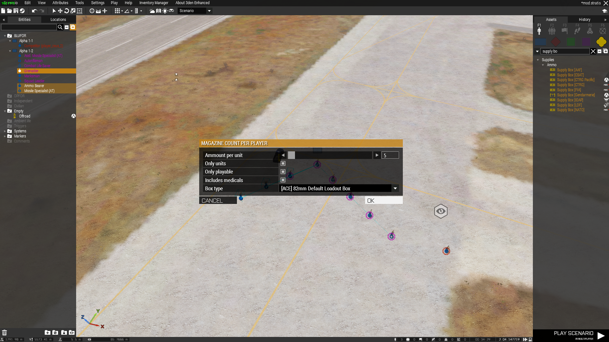

# Create supply box

Allow you to create a supply create based on selected objects inventory inside eden editor.

# Usage

1. Select objects

2. Right click on one of selected objects and click on `create supply box`

3. You can change parameters

