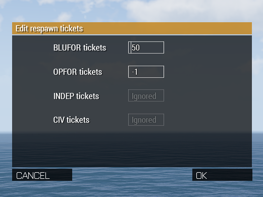

# addRespawnTicketsModule

This module help you create and manage a custom tickets respawn system.



## Usage

You have 4 field, one per side. Each field corresponds to one variable inside the `missionNamespace`.

- Blufor = `timberZA_main_BluforTicketCount`
- Opfor = `timberZA_main_OpforTicketCount`
- Independent = `timberZA_main_IndepTicketCount`
- Civilian = `timberZA_main_CivilianTicketCount`

**Inputs will be disabled if the corresponding missionNamespace variables aren't defined in the mission files. If none of the variables are defined, the module will not be available in the zeus interface.**

### Get current ticket count

```sqf
// this will give you the current ticket count for blufor
private _bluforTicketCount = missionNamespace getVariable ["timberZA_main_BluforTicketCount", 0];
```

###  Change ticket count

```sqf
private _bluforTicketCount = missionNamespace getVariable ["timberZA_main_BluforTicketCount", 0];

// This will change the ticket count for blufor, because getVariable works by reference
_bluforTicketCount = 100;

// Or you can be more explicit by using setVariable and achieve the same result
missionNamespace setVariable ["timberZA_main_BluforTicketCount", 100];
```

## Practical example

```sqf
{
    _x addEventHandler ["Respawn", {
        params ["_unit", "_corpse"];

        switch (side _unit) do {
            case west : {
                private _bluforTicketCount = missionNamespace getVariable ["timberZA_main_BluforTicketCount", 0];
                missionNamespace setVariable ["timberZA_main_BluforTicketCount", _bluforTicketCount - 1, true];
            };
            case east : {
                private _opforTicketCount = missionNamespace getVariable ["timberZA_main_OpforTicketCount", 0];
                missionNamespace setVariable ["timberZA_main_OpforTicketCount", _opforTicketCount - 1, true];
            };
            case independent : {
                private _indepTicketCount = missionNamespace getVariable ["timberZA_main_IndepTicketCount", 0];
                missionNamespace setVariable ["timberZA_main_IndepTicketCount", _indepTicketCount - 1, true];
            };
            case civilian : {
                private _civilianTicketCount = missionNamespace getVariable ["timberZA_main_CivilianTicketCount", 0];
                missionNamespace setVariable ["timberZA_main_CivilianTicketCount", _civilianTicketCount - 1, true];
            };
        };
    }];
} foreach allPlayers;
```
